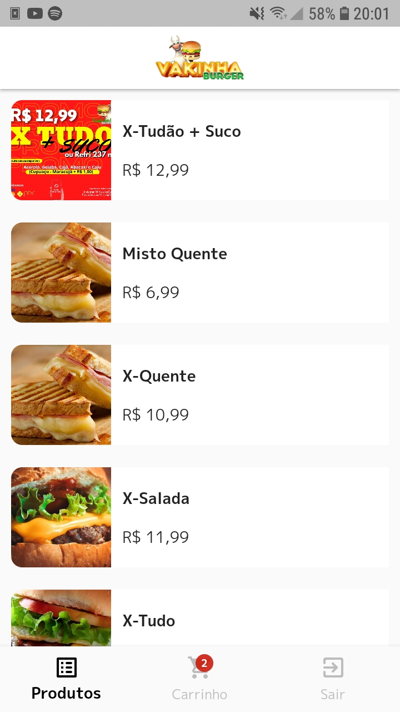
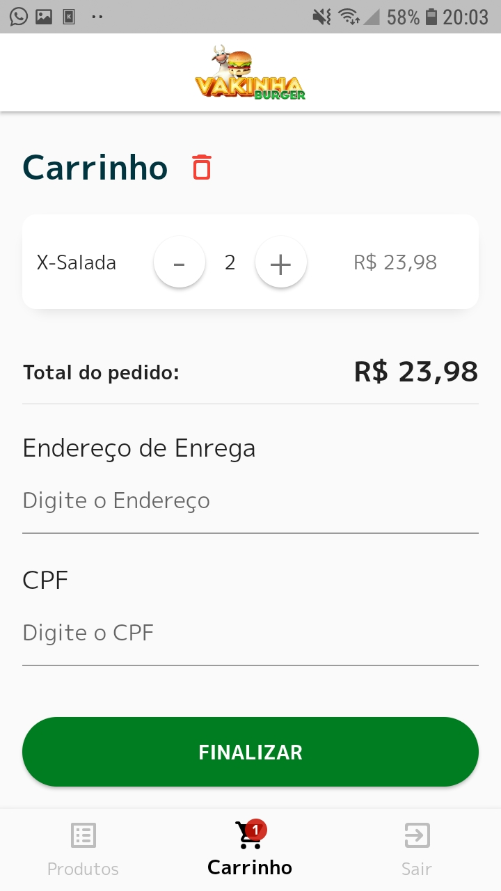

# Vaquinha Burger
Vaquinha Burger Mobile, aplicativo baseado nos vídeos do Dart Week 5 por Rodrigo Rahman.

### Screenshot






### Links

- Figma: [https://www.figma.com/file/9SmHLBGayHJL5PzeUmTBsQ/Vaquinha-Canal-(Copy)?node-id=0%3A1](https://www.figma.com/file/9SmHLBGayHJL5PzeUmTBsQ/Vaquinha-Canal-(Copy)?node-id=0%3A1)

### Construido com

- Flutter 2.10.0
- Dart 2.16.0
- GetX 4.6.1

### O que aprendi

Construindo este aplicativo conheci o widget 'visibility' que nunca tinha usado antes, é um widget muito útil que renderiza na tela um determinado conjunto de código de acordo com alguma condição.

```dart
...
child: Visibility(
    visible: controller.products.isNotEmpty,
    // se visible == false
    replacement: Column(
    crossAxisAlignment: CrossAxisAlignment.start,
    children: [
        Text(
        'Carrinho',
        style: context.textTheme.headline5?.copyWith(
            fontWeight: FontWeight.bold,
            color: context.theme.primaryColorDark,
        ),
        ),
        const SizedBox(height: 10),
        const Text('Nenhum item adicionando no carrinho!')
    ],
    ),
    // se visible == true
    child: Column(
    ...
```

## Autor

- Website - [Hans M Boron](https://www.mehsys.com.br)
- GitHub - [@hansmboron](https://www.github.com/hansmboron)
- YouTube - [@HansMBoron](https://www.youtube.com/c/HansMBoron)
- LinkedIn - [@hansmateusboron](https://www.linkedin.com/in/hansmateusboron/)
